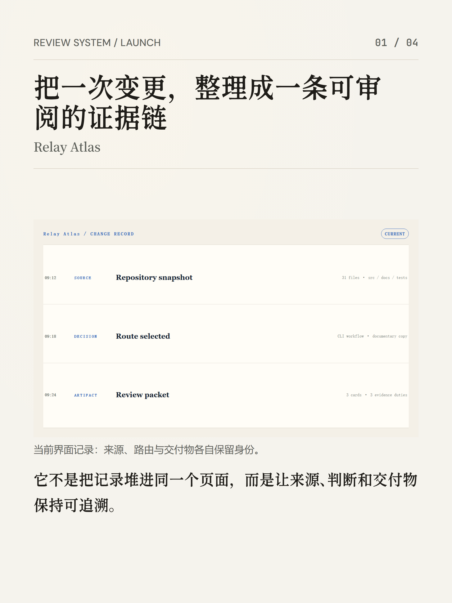
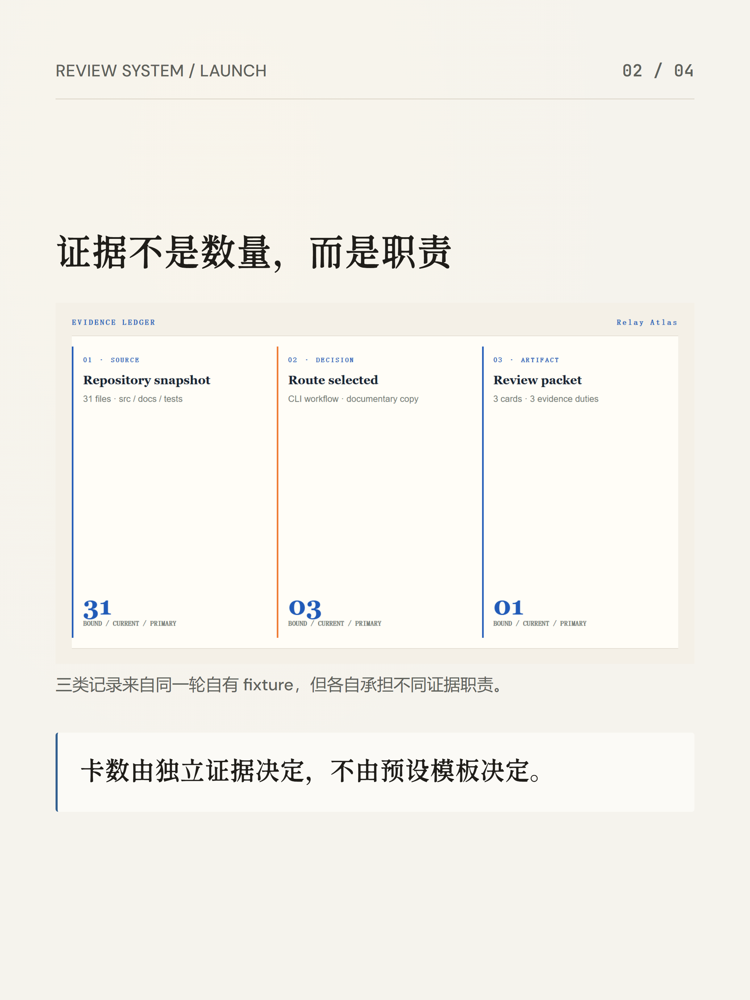
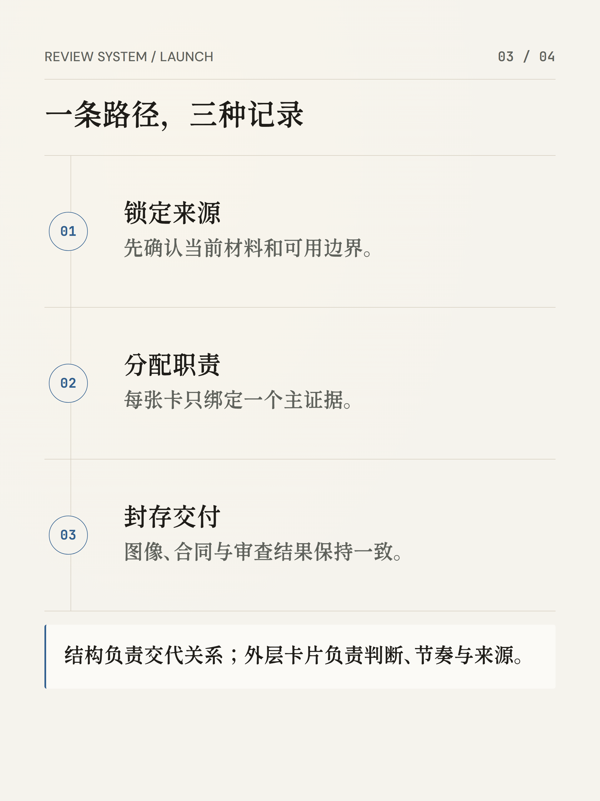
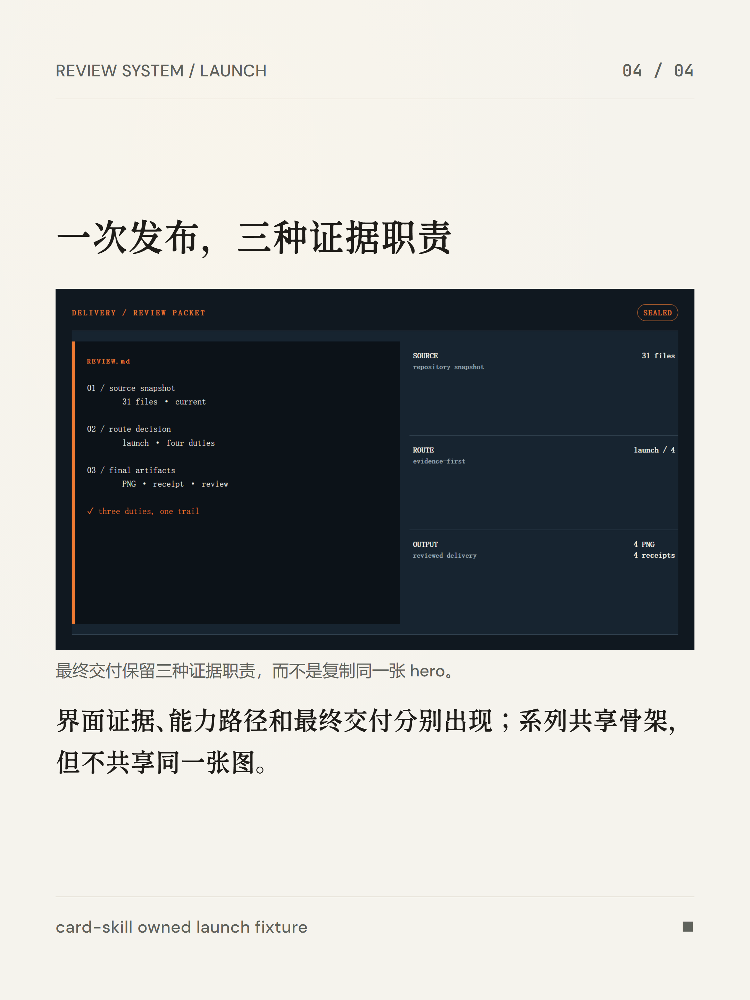
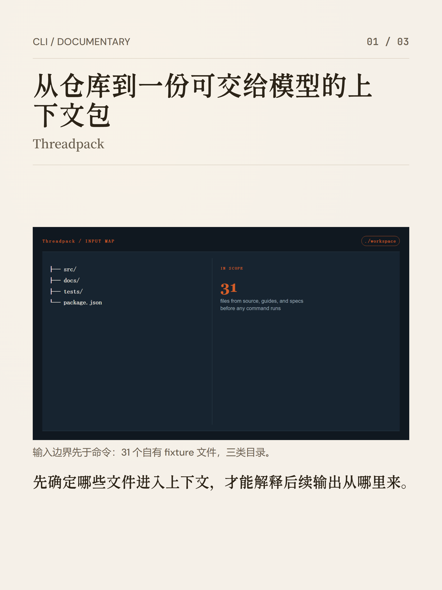
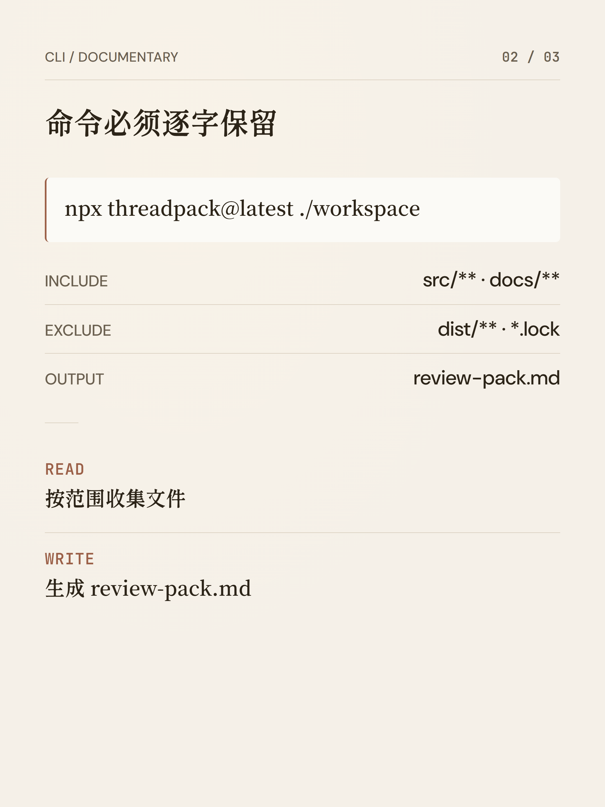
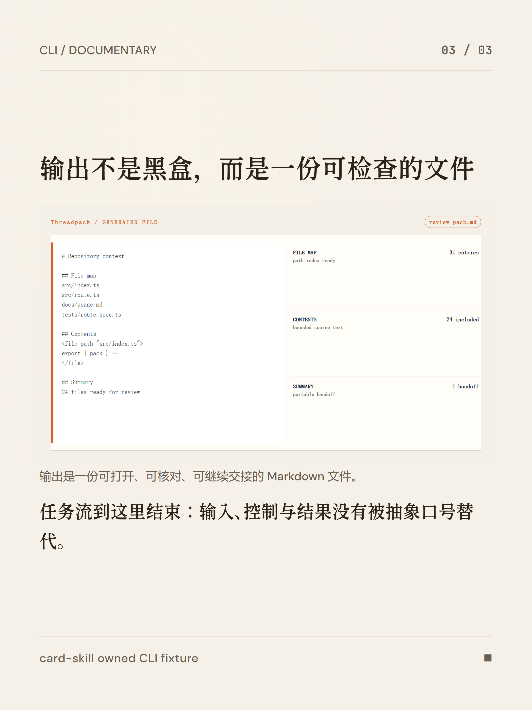

<p align="center"></p>

<h1 align="center">card-skill</h1>

<p align="center"><strong>把文章、观点和论证，做成可以直接发布的图片。</strong></p>

<p align="center">
  <a href="README.md">English</a> ·
  <a href="#它是什么">它是什么</a> ·
  <a href="#如何安装-card-skill">安装</a> ·
  <a href="#复制即用的自然语言示例">示例</a> ·
  <a href="#不同发布任务该选哪种图">选模具</a> ·
  <a href="#faq">FAQ</a> ·
  <a href="#完整样张">样张</a>
</p>

## 它是什么

**card-skill** 是给 Claude Code、Codex、OpenCode、Pi 等 coding agent 使用的开源内容制图 skill。你输入文章、笔记、观点、URL，或明确指定的微信读书数据；它会理解内容结构，自动选择版式与 Quiet Paper 气质，输出经过检查的 PNG。

它覆盖公众号/博客头图、小红书与社媒卡片、白板推演、正文解释图（公式卡/关系图）、信息图、漫画与视觉手记等发布任务。渲染脚本、模板、字体、schema 和检查器都在完整安装包内；默认本地截图与质检，不自动上传文章或成品。

它不是网站生成器、UI 组件库、Logo/VI 系统、图表库或修图工具。

## 适合什么，不适合什么

| 适合 | 不适合 |
|---|---|
| 公众号头图、博客封面、正文氛围插图 | 网站、落地页、App / 组件 UI |
| 小红书 / 社媒观点卡与系列卡 | Figma 原型、Logo / VI 系统 |
| 论证白板、系统关系、技术决策图 | 图表库式数据绘图 |
| 正文解释图：公式卡、关系、流程、边界 | 通用修图、格式转换、照片处理 |
| 微信读书个人划线卡、阅读月报（显式请求时） | 因书名就隐式扫描整本账号正文 |
| 需要可复现 PNG 与裁切/溢出/坏图检查的批量出图 | 一次性聊天配图、不要求质检的草图 |

## 30 秒看懂它能做什么

同一套安静的纸面骨架，可以承载不同的发布任务：封面负责制造张力，社媒卡片负责拆解观点，白板负责把推理关系画清楚。下面的样张全部取材于杰夫·霍金斯的《千脑智能》：同一本书的不同关系，应该长成不同的画面，而不是换个模板重述一遍。

<table>
<tr>
<td width="33.33%" valign="top">
<br>
<strong>公众号 / 博客头图</strong><br>
<sub>editorial-image · 提炼张力与隐喻，不复述摘要</sub>
</td>
<td width="33.33%" valign="top">
<br>
<strong>小红书 / 社媒卡片</strong><br>
<sub>poster · 从一句观点到多卡拆解</sub>
</td>
<td width="33.33%" valign="top">
<br>
<strong>白板推演</strong><br>
<sub>whiteboard · 把问题、约束与路径画清楚</sub>
</td>
</tr>
</table>

| 你要发布什么 | 默认 mode | 画面在解决什么 |
|---|---|---|
| 公众号或博客头图 | `editorial-image` | 情绪、核心张力、视觉隐喻；不是要点摘要卡 |
| 正文中的解释图 | `article-diagram` | 把局部论点压成公式卡或结构关系 |
| 小红书或社媒系列 | `poster` / `big` / `long` | 按内容密度选择一句话、多卡或长阅读卡 |
| 论证、系统关系、技术决策 | `whiteboard` | 问题、约束、路径与决策关系 |
| 数据、叙事或个人反思 | `infograph` / `comic` / `sketchnote` | 信息密度、冲突转折或手记感 |
| 微信读书划线 / 月报 | `poster`（及按需 `big` / `long`） | 保留原文划线与真实统计，不编造洞察 |

## 如何安装 card-skill

完整安装包包含渲染脚本、模板、字体、schema 和检查器。**不要只装仓库根目录的 `SKILL.md`**；裸装会导致缺运行时，无法稳定出图。

### Claude Code / Codex（推荐）

```bash
# Claude Code
claude plugin marketplace add KKenny0/card-skill
claude plugin install card-skill@card-skill

# Codex
codex plugin marketplace add KKenny0/card-skill
codex plugin add card-skill@card-skill
```

插件安装器不会执行 npm 生命周期脚本。首次制图时，agent 会在已安装的 skill 目录执行一次 `node scripts/setup-runtime.mjs`，安装锁定的 npm 依赖和 Playwright Chromium；后续使用会复用现有运行时。

### 其他 agent 或临时使用

普通 agent 安装完整 skill 包（将 `-a codex` 换成对应 agent ID）：

```bash
npx skills add KKenny0/card-skill/plugins/card-skill/skills/card-skill -a codex -g -y
cd ~/.agents/skills/card-skill
npm install
npx playwright install chromium
```

只想临时使用一次：

```bash
npx skills use KKenny0/card-skill/plugins/card-skill/skills/card-skill --skill card-skill
```

**运行要求：** Node.js 22+ 与 npm；PNG 截图依赖 Playwright 与 Chromium。字体随 skill 分发，截图只允许 `file:` 与 `data:` 资源，不依赖运行期网络。

<details>
<summary>可选：在 Codex 对话中先看方向</summary>

在支持对话内交互卡片的 Codex 桌面会话中，可以明确要求先看方向，再决定是否出图：

```text
先给我 3 个公众号头图方向，用卡片展示每个方向的视觉隐喻、比例、适用理由和风险；我选定后再渲染 PNG。
```

选择后仍由现有 Stable / Studio 流程渲染、截图、检查并返回 PNG。普通请求不会被强制插入选择步骤；Codex CLI、IDE 或其他 agent 会退回文字候选列表。

</details>

## 复制即用的自然语言示例

不需要斜杠命令；中文、英文自然语言都可以触发。默认不会先让你挑风格，也不会自动加入作者名或头像。

**公众号头图**

```text
把下面这篇文章做成一张公众号头图。不要复述摘要，提炼文章的核心张力，用安静的纸张质感呈现，完成后检查裁切、换行和可读性：

[在这里粘贴文章或 URL]
```

**正文解释图 / 公式卡**

```text
把这篇文章里值得压缩的章节做成正文解释图。每张只保留核心关系公式和一句判断，跳过纯铺垫和纯情绪段落。
```

**小红书 / 社媒系列**

```text
把下面这段观点拆成一组小红书卡片。第一张是总判断，后面每张只讲一个支撑点，风格克制，不要营销腔。
```

**白板推演**

```text
把这个技术决策画成白板卡：写清问题、约束、可选路径和最终取舍，让没参与讨论的人也能看懂。
```

**微信读书划线卡 / 月报**

```text
把我在《千脑智能》里的个人划线和想法做成一组卡片。原文不要改写，把我的想法放在对应划线下面；没有明确对应关系的想法单独放，最后标明来源。

把我这个月的微信读书数据做成阅读月报。只使用真实返回的时长、天数、读完数量和偏好；缺少的模块直接省略，不要补造洞察。
```

## 不同发布任务该选哪种图

优先从发布任务理解需求，再映射到内部 mode；不必先背 mode 名称。内容结构明显更适合其他 mode 时，会自动改走更合适的路线。

| 你要做什么 | 推荐 mode | 结果 |
|---|---|---|
| 公众号或博客头图 | `editorial-image` | 提炼情绪、核心张力和视觉隐喻，不把文章改写成要点列表。 |
| 正文中的解释图 | `article-diagram` | 把局部论点压成公式卡、关系图、流程图或边界模型。 |
| 小红书或社媒系列 | `poster` / `big` / `long` | 从一句观点到多卡拆解，按内容密度选择画布。 |
| 论证、系统关系、技术决策 | `whiteboard` | 把问题、约束、路径和决策关系画清楚。 |
| 数据、叙事或个人反思 | `infograph` / `comic` / `sketchnote` | 在信息密度、冲突转折和手记感之间选择表达方式。 |

## card-skill 支持哪些视觉格式

Stable 适合出版场景、批量生产和品牌一致性。Studio 适合概念隐喻、叙事张力和个性化表达。两者都走正式 schema、renderer、截图和 `check-output`；Studio 额外要求完整构图契约与人工视觉验收。

| Mode | Tier | 最适合 | 详细说明 |
|---|---|---|---|
| `editorial-image` | Stable / Studio | 公众号头图、博客封面、正文氛围插图 | [mode-editorial-image](references/mode-editorial-image.md) |
| `article-diagram` | Stable | 正文公式卡、关系图、流程图、边界模型 | [mode-article-diagram](references/mode-article-diagram.md) |
| `poster` | Stable | 社媒系列卡片、章节拆分 | [mode-poster](references/mode-poster.md) |
| `whiteboard` | Stable | 论证、因果链、系统关系与技术决策 | [mode-whiteboard](references/mode-whiteboard.md) |
| `long` | Stable | 文章型长卡片与沉浸阅读 | [mode-long](references/mode-long.md) |
| `big` | Stable | 一句话观点、标题与宣言 | [mode-big](references/mode-big.md) |
| `infograph` | Studio | 数据、比较、层级与高密度信息 | [mode-infograph](references/mode-infograph.md) |
| `comic` | Studio | 冲突、转折或前后变化的叙事 | [mode-comic](references/mode-comic.md) |
| `sketchnote` | Studio | 个人反思、经验与温暖叙事 | [mode-sketchnote](references/mode-sketchnote.md) |

## 关键能力

- **9 种模具：** `editorial-image`、`article-diagram`、`poster`、`big`、`long`、`whiteboard`、`infograph`、`comic`、`sketchnote`
- **证据主导的 Poster 区块：** 当前本地 PNG/JPEG/WebP 证据会在浏览器截图前封存为有资源上限的私有快照，2–5 步原生流程直接占据版面；不引入卡中卡外框、不让浏览器读取原始来源路径，renderer 也不联网。
- **两层交付：** Stable（命令行确定性渲染）与 Studio（完整构图契约 + 人工视觉验收）
- **统一气质：** Quiet Paper——温暖纸色、克制墨色、细分隔线、小圆角、极少阴影
- **四个默认 tone：** `reflective` / `sharp` / `warm` / `technical`；26 个 design 仍可作为显式高级覆盖
- **默认输出：** 默认 2 倍像素密度 PNG；以常见 1080 CSS 像素画布为例，导出宽度约 2160px（高度随 mode 与比例变化）
- **质量门禁：** 截图前后检查占位符、溢出、裁切、坏图、可读性、标题换行、字体栈、远程资源与近乎空白结果
- **证据优先推理：** Visual Job v3 把每张 PNG 绑定到当前强证据、artifact 职责、确定性 taxonomy 路由、真实 PNG 批评和最多一次修订
- **开源工具自适应路由：** launch、CLI、UI 产品、Library/API、benchmark 与 infra 来源只生成证据足以支持的 1–4 张非重复卡片
- **运行时：** Node.js 22+、Playwright Chromium；字体随包分发并做加载预检
- **隐私默认：** PNG 渲染与检查在本地完成；版本检查只读 GitHub Release API，不上传文章、提示词或图片
- **可选来源：** 与腾讯官方 [WeChatReading Skill](https://github.com/Tencent/WeChatReading) 组合，仅在用户明确请求时读取个人划线/统计

## 开源工具自适应 Showcase

完全自有的 `Relay Atlas` launch fixture 与 `Threadpack` CLI fixture 会刻意走两条不同路线：前者有四项独立证据职责，后者在三张任务流卡片处结束。两组都保留 Quiet Paper 骨架，证据表面则分别使用蓝色审阅台账与橙色终端信号。

<table>
<tr>
<td width="25%"></td>
<td width="25%"></td>
<td width="25%"></td>
<td width="25%"></td>
</tr>
</table>
<table>
<tr>
<td width="33%"></td>
<td width="33%"></td>
<td width="33%"></td>
</tr>
</table>

所有可见项目数据均为虚构且归仓库自有。参见[可复现 showcase](https://github.com/KKenny0/card-skill/tree/main/showcases/open-source-tool)；K3、Repomix 与其他第三方材料仍只用于本地验收。

## 为什么输出像纸面，而不是网页截图

所有模式共享同一套 Quiet Paper 骨架。内容色调和品牌气质只改变表面温度、强调色和节奏，不把作品变成品牌皮肤拼盘。

- 默认根据内容结构、密度、情绪和发布用途自动选择 mode、tone 与画面方向。
- `editorial-image` 会先判断 `reflective`、`sharp`、`warm` 或 `technical` 气质，再落到真实可渲染的 Quiet Paper design。
- `article-diagram` 会先筛出值得压缩的章节，再为每个章节生成公式卡；不适合压缩的铺垫、情绪和结论章节会被跳过。
- 默认署名、头像和来源字段为空；只有输入明确提供时才使用 `brand_name`、`logo`、`source`。本地 PNG/JPEG/WebP Logo 会先经过字节与像素上限检查、私有快照和内嵌，再交给 Chromium。

## 从文本到 PNG 经历哪些步骤

1. 读取 URL、粘贴文本、开源项目材料、微信读书返回的数据或本地文件。
2. 在决定卡数前，盘点有边界的证据、新鲜度与素材使用权。
3. 为每张预期 PNG 指定唯一证据职责与 Visual Plan；开源工具系列在 1–4 张之间自适应，不重复凑数。
4. 由可执行 taxonomy 校验 mode；用户明确点名的 mode 仍可覆盖。
5. 通过既有 schema、renderer、Playwright 和 `check-output` 链渲染候选图。
6. 查看每张真实 PNG 并写入哈希绑定的 Visual Review；低于 8.0 或存在 blocker 时，最多修改计划和渲染契约一次。
7. 原子发布通过的 PNG、receipt 与 review；默认写入 `~/Downloads/`。

和直接让 AI 随手画一张图不同：card-skill 走结构化输入、固定 renderer、Playwright 截图和 `check-output` 质检，目标是可复现的发布级 PNG。

<details>
<summary>高级：运行环境、更新与隐私</summary>

### 运行环境

如果首次渲染提示缺少依赖，请在 skill 安装目录运行：

```bash
npm install
npx playwright install chromium
```

三套西文字体的上游、许可和校验摘要见 [`assets/fonts/FONT_SOURCES.md`](assets/fonts/FONT_SOURCES.md)；预检脚本会验证字体是否真加载，避免静默回退到系统字体。

默认使用 2 倍像素密度。不同 mode 和比例会有不同高度，不应理解为固定的 4K 宽图。

### 更新提醒与隐私

每次 agent 开始使用 card-skill 时，会先检查 GitHub 上最新的正式 Release；Stable 命令行渲染入口也会自动再做一次防守式检查。当前输出完成后，命令行会在后台把已安装副本升级到该 Release 解析出的固定 commit，完成版本回读与运行时准备后，下一次使用生效；当前渲染不会切换版本。检查按安装副本分别缓存，一天最多一次；并发渲染和升级会通过安装锁错开。升级失败会恢复旧副本，不改变本次出图结果，后续请求会重试。手动更新入口如下：

```bash
# npx skills 安装（将 <tag> 替换为更新提示中的 Release tag）
npx --yes --package skills@1.5.19 -- skills add KKenny0/card-skill/plugins/card-skill/skills/card-skill#<tag> --skill card-skill -g -y

# Codex 插件安装（脚本会校验 Release tag 对应的 commit）
node scripts/check-update.mjs --auto-update

# Claude Code 插件安装（由 Claude Code 原生 marketplace 更新）
claude plugin marketplace update card-skill
claude plugin update card-skill@card-skill
```

版本检查只访问 GitHub Release API；实际升级由已安装的 Codex CLI、固定版本的 `skills` CLI，或 Claude Code 原生 marketplace 从 GitHub/npm 下载。这些路径都不会上传文章、提示词、路径或图片。只有明确提出微信读书请求时才会访问个人数据；个人内容会进入当前 Agent / 模型上下文用于整理，PNG 渲染与检查由本地脚本完成，不会自动上传或发布成品。

如需完全关闭检查和自动升级，设置 `CARD_SKILL_DISABLE_UPDATE_CHECK=1`。

如需保留检查但关闭自动升级，设置 `CARD_SKILL_DISABLE_AUTO_UPDATE=1`。

</details>

<details>
<summary>高级：命令行、自定义布局与 PNG 体积</summary>

结构化命令行可以单独使用：

```bash
node scripts/card.js --input /path/to/input.json --output ~/Downloads/card.png
```

Stable 命令行模式：`big`、`long`、`whiteboard`、`poster`、`editorial-image`、`article-diagram`。Studio 命令行模式：`infograph`、`comic`、`sketchnote`；它们要求完整的 `content_html` + `custom_css` 构图契约，并仍需人工视觉验收。

自然语言任务使用 Visual Job v3。每个 artifact 都要写明证据、职责、文件名、转换方式与 Visual Plan。先渲染候选：

```bash
node scripts/render-job.mjs --input visual-job.json --output-dir ./candidate --candidate --json
```

候选渲染还会通过内部 manifest 保留已检查 HTML 与完整产物集合。宿主 Agent 查看每张 PNG 并写入匹配的 review 后，先把候选目录摘要记录在该目录之外。发布器要求显式传回这份外部审批摘要，随后重跑 `check-output`，再发布通过的三件套：

```bash
$approvedSha = node scripts/hash-reviewed-candidate.mjs --candidate-dir ./candidate
node scripts/publish-reviewed-job.mjs --candidate-dir ./candidate --output-dir ./output --expected-candidate-sha256 $approvedSha --json
```

Visual Job v1/v2 与直接 `card.js` 继续作为兼容的底层路径。参见[当前架构](docs/current-architecture.md)、[Visual Job](references/visual-job.md)、[来源边界](references/source-material.md)、[开源工具路由](references/source-open-source-tool.md)与[Visual Review](references/visual-review.md)。

`editorial-image` 的文章封面会用确定性的 `cover_motif` 把文章张力落到右侧主视觉；复杂头图、概念隐喻和正文配图仍优先使用 `content_html` + `custom_css`。`in-article` 与 `metaphor` 不会再静默回退到默认脚手架。完整的 skill 行为与输入边界见 [`SKILL.md`](SKILL.md)。

默认 PNG 无损，长文卡可能达到 10–17MB。如需更小体积，可以单独使用 `pngquant`：

```bash
pngquant --quality=80-95 --force --output card.png card.png
```

</details>

## FAQ

### card-skill 是什么？

card-skill 是给 coding agent 用的开源内容制图 skill。输入文章、笔记、观点或明确授权的微信读书数据，输出带质量检查的 PNG，用于公众号头图、社媒卡片、白板和正文解释图等场景。

### 需要会设计或手写 HTML 吗？

通常不需要。用自然语言说明发布任务即可；agent 会选择 mode、生成结构化输入并渲染。Studio 模式（如复杂隐喻、信息图、漫画）可能由 agent 编写完整构图，但仍走统一截图与检查链。

### 支持哪些 agent？

面向 Claude Code、Codex、OpenCode、Pi 等能安装 agent skill 的环境。Claude Code 与 Codex 推荐用官方插件市场安装；其他 agent 可用 `npx skills add` 安装完整 skill 包。

### 默认会不会加上作者名或头像？

不会。`brand_name`、`logo`、`source` 只有在你明确提供时才写入画面；未提供则留空并隐藏对应区域。

### 和直接让 AI 生成一张图有什么不同？

card-skill 使用结构化 Visual Plan、可执行 mode taxonomy、确定性或受控 renderer、Playwright 截图、`check-output` 与真实 PNG Critic 门禁。目标是可复现的发布级 PNG，不是一次性聊天配图。

### 公众号头图和正文解释图怎么选？

要封面张力、情绪和隐喻时用 `editorial-image`。要把某一段论证压成公式、关系、流程或边界时用 `article-diagram`。前者不是摘要卡，后者不是装饰插图。

### 会不会上传我的文章或图片？

默认不会。渲染与检查在本地完成。版本检查只读 GitHub Release API。只有你明确提出微信读书请求时，才会经官方 WeChatReading Skill 读取你指定的个人数据。

### 装错成仓库根目录会怎样？

会得到不完整安装：缺少 `scripts/`、`assets/`、`schemas/` 等运行时，无法稳定出图。应安装插件包或 `plugins/card-skill/skills/card-skill` 这条完整路径。

### Stable 和 Studio 有什么区别？

Stable（如 `big`、`poster`、`whiteboard`、多数封面）走命令行结构化渲染，适合批量与一致性。Studio（如 `infograph`、`comic`、`sketchnote`，以及复杂正文隐喻）要求完整构图契约，并仍需人工看图验收。

### 微信读书需要什么权限？

需要单独安装腾讯官方 WeChatReading Skill，并按官方说明配置 `WEREAD_API_KEY`。不要把 Key 贴进对话、卡片输入或仓库文件。card-skill 不会因为只看到书名就扫描账号。

## 完整样张

<details>
<summary>展开 gallery</summary>

<p><sub>全部样张基于《千脑智能》（Jeff Hawkins）的概念转述；阅读笔记样张会明确标注为非原文划线。</sub></p>

| 任务 | mode | 画面在解决什么 |
|---|---|---|
| 公众号头图 | `editorial-image` | 千个模型，一个判断——右侧隐喻承载张力 |
| 正文公式卡 | `article-diagram` | 感觉、运动与参考系的关系压缩 |
| 一句话观点 | `big` | 探索世界 |
| 社媒系列 | `poster` | 三条线索拆卡 |
| 长阅读卡 | `long` | 智能是建模 |
| 白板推演 | `whiteboard` | 认识一个杯子 |
| 边界模型（兼容样张） | `article-diagram` | 参考系边界模型 |
| 阅读笔记（概念转述） | `poster` | 划线式知识卡，非原文账号数据 |
| 信息图 | `infograph` | 局部模型到共同判断 |
| 漫画 | `comic` | 摸到一条边以后 |
| 视觉手记 | `sketchnote` | 感觉、定位与预测 |
| 阅读导览 | `poster` | 阅读导览 |

<table>
<tr>
<td width="50%"><br><strong>editorial-image</strong> · 千个模型，一个判断</td>
<td width="50%"><br><strong>article-diagram</strong> · 感觉、运动与参考系</td>
</tr>
<tr>
<td><br><strong>big</strong> · 探索世界</td>
<td><br><strong>poster</strong> · 三条线索</td>
</tr>
<tr>
<td><br><strong>long</strong> · 智能是建模</td>
<td><br><strong>whiteboard</strong> · 认识一个杯子</td>
</tr>
<tr>
<td><br><strong>article-diagram</strong> · 参考系边界模型</td>
<td><br><strong>poster</strong> · 阅读笔记（概念转述）</td>
</tr>
<tr>
<td><br><strong>infograph</strong> · 局部模型到共同判断</td>
<td><br><strong>comic</strong> · 摸到一条边以后</td>
</tr>
<tr>
<td><br><strong>sketchnote</strong> · 感觉、定位与预测</td>
<td><br><strong>poster</strong> · 阅读导览</td>
</tr>
</table>

</details>

## 如何把微信读书划线做成卡片

card-skill 可以和腾讯官方 [WeChatReading Skill](https://github.com/Tencent/WeChatReading) 组合使用，把你明确指定的一本书里的个人划线与想法做成卡组，或把个人阅读统计做成月报 / 年报。

它不读取任意章节正文，也不会因为只看到一本书名就扫描账号。腾讯 Skill 负责认证和读取；card-skill 只整理当前任务需要的数据，并在本地完成 PNG 渲染与检查。

<table>
<tr>
<td width="50%"><br><strong>阅读导览</strong></td>
<td width="50%"><br><strong>概念转述笔记</strong></td>
</tr>
</table>

先单独安装官方来源 Skill，再按官方说明设置 `WEREAD_API_KEY`；不要把 API Key 粘贴到对话、卡片输入或仓库文件中：

```bash
npx skills add Tencent/WeChatReading -g
```

```text
把我在《千脑智能》里的个人划线和想法做成一组卡片。原文不要改写，把我的想法放在对应划线下面；没有明确对应关系的想法单独放，最后标明来源。

把我这个月的微信读书数据做成阅读月报。只使用真实返回的时长、天数、读完数量和偏好；缺少的模块直接省略，不要补造洞察。
```

## 作者、案例与维护

**card-skill** 由 [Kenny Wu（@KKenny0）](https://github.com/KKenny0) 维护，[MIT](LICENSE) 许可。定位是 coding agent 的内容制图 skill，不是通用设计产品。

如果 card-skill 帮你做出了值得发布的图，欢迎在 [GitHub Issues](https://github.com/KKenny0/card-skill/issues) 分享：

- 最终图片或公开发布链接
- 使用的提示词（敏感内容可删减）
- mode 与 agent
- 仍需要手工调整的地方

真实案例会帮助判断下一步该优化哪种发布任务；经作者同意后，优秀案例也可能进入 gallery，并保留来源署名。

你也可以通过 [Support](https://kkenny0.github.io/support/) 支持后续维护。支持会帮助继续维护字体、浏览器渲染、图片压缩、模具质量和跨 agent 兼容性。

### 建议的 GitHub Topics

便于发现与检索时，可为仓库勾选例如：`agent-skills`、`claude-code`、`codex`、`infographic`、`poster`、`wechat`、`png`、`editorial`、`whiteboard`、`openai-codex`。

## Credits

card-skill 受到以下项目与实践启发：

- [awesome-design-md](https://github.com/VoltAgent/awesome-design-md) by VoltAgent — 品牌设计参考库。
- [ljg-card](https://github.com/lijigang/ljg-skills/tree/master/skills/ljg-card) by lijigang — 内容制图与早期品味规则。
- [Kami](https://github.com/tw93/kami) by tw93 — Quiet Paper 的纸面、墨色与节奏约束。
- [The New Yorker cover practice](https://www.newyorker.com/culture/video-dept/the-art-of-the-new-yorker-cover) 与 [GOV.UK image guidance](https://guidance.publishing.service.gov.uk/formatting-content/images/) — 编辑配图的用途与克制原则。

## License

[MIT](LICENSE) © 2026 Kenny Wu
